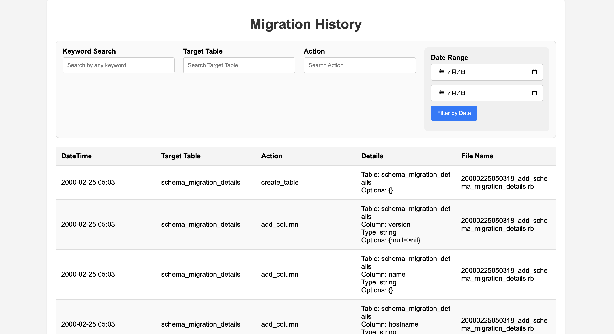

# MigrationHistory

`migration_history` is a gem that helps track migration history in Rails projects. It provides a simple way to see when tables and columns were added, along with other details from your migration files. You can view this information in either CLI or HTML format.

## Installation

Add this line to your application's Gemfile:

```ruby
gem 'migration_history'
```

And then execute:

    $ bundle

Or install it yourself as:

    $ gem install migration_history

## Usage

### Track When a Table or Column Was Added with Filters
With the filter command, you can query the migration history to find out when a specific table or column was added to your database. This allows you to focus on specific changes to your schema, such as the creation of a table or the addition of a column.

Example: Filter by Table Name
To find out when a specific table, such as users, was created, you can filter the migration history by table name. For example:
```ruby
bundle exec migration_history filter --table users
```
Example Output:
```ruby
ClassName: AddUsersTable, Timestamp: 2020-01-02 12:30:45
```

Example: Filter by Table Name and Column Name
To find out when a specific column, such as email, was added to a table, you can filter the migration history by table and column name. For example:
```ruby
bundle exec migration_history filter --table users --column email
```
Example Output:
```ruby
ClassName: AddEmailColumnToUsersTable, Timestamp: 2020-01-02 12:30:45
```

Example: No Filter, All migration history
To view the entire migration history in the terminal:

```ruby
bundle exec migration_history all
```

### HTML and JSON Output
You can have more readable output by using the `--format` option to output the result in HTML or JSON formats.

Example: with HTML Output
```ruby
bundle exec migration_history all --format=html
```

By default, the output file name will be `migration_history.html`. You can specify the output file name by using the `--output` option.
The generated HTML file looks like this:

In this HTML file, you can filter the migration history by table name, column name, keyword search, target table, action, and date range.

Example: with JSON Output
```ruby
bundle exec migration_history all --format=json
```

## Development

After checking out the repo, run `bin/setup` to install dependencies. Then, run `rake spec` to run the tests. You can also run `bin/console` for an interactive prompt that will allow you to experiment.

To install this gem onto your local machine, run `bundle exec rake install`. To release a new version, update the version number in `version.rb`, and then run `bundle exec rake release`, which will create a git tag for the version, push git commits and tags, and push the `.gem` file to [rubygems.org](https://rubygems.org).

## Contributing

Bug reports and pull requests are welcome on GitHub at https://github.com/a5-stable/migration_history. This project is intended to be a safe, welcoming space for collaboration, and contributors are expected to adhere to the [Contributor Covenant](http://contributor-covenant.org) code of conduct.

## License

The gem is available as open source under the terms of the [MIT License](https://opensource.org/licenses/MIT).

## Code of Conduct

Everyone interacting in the MigrationHistory project’s codebases, issue trackers, chat rooms and mailing lists is expected to follow the [code of conduct](https://github.com/a5-stable/migration_history/blob/master/CODE_OF_CONDUCT.md).
